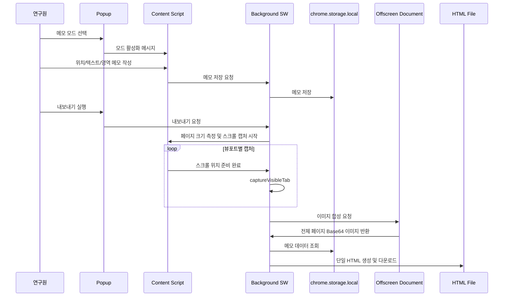

# 아키텍처

## 개요

이 프로젝트는 WXT 기반 Chrome Manifest V3 확장 프로그램이다. 확장 프로그램은 웹페이지 위에서 메모를 작성하고, 전체 페이지 스크린샷과 메모 데이터를 단일 HTML 파일로 내보낸다.

서버는 없다. 모든 상태는 브라우저 로컬에 저장되며, 전달 단위는 `.html` 파일이다.

## 확장 프로그램 구조

권장 디렉터리 구조는 다음과 같다.

```text
.
├─ entrypoints/
│  ├─ background.ts
│  ├─ content.tsx
│  ├─ popup/
│  │  ├─ App.tsx
│  │  └─ index.html
│  └─ offscreen/
│     ├─ index.html
│     └─ stitcher.ts
├─ src/
│  ├─ components/
│  ├─ capture/
│  ├─ export/
│  ├─ memo/
│  ├─ storage/
│  ├─ security/
│  └─ shared/
├─ docs/
└─ package.json
```

## 주요 컴포넌트

### Content Script

Content Script는 실제 웹페이지에 주입되는 UI와 페이지 측정 기능을 담당한다.

- 메모 오버레이 렌더링
- 위치 메모 클릭 처리
- 텍스트 선택 감지
- 영역 드래그 처리
- 현재 문서의 크기, 스크롤 위치, 뷰포트 크기 측정
- 스크롤 캡처를 위한 페이지 이동 제어
- 메모 좌표를 문서 기준과 비율 기준으로 계산
- Popup 또는 Background와 메시지 교환

Content Script는 메모 작성 경험에 집중하고, 파일 생성과 다운로드는 직접 담당하지 않는다.

### Background Service Worker

Background Service Worker는 확장 프로그램의 중앙 메시지 라우터 역할을 한다.

- Popup과 Content Script 사이의 메시지 중계
- `chrome.tabs.captureVisibleTab` 호출
- `chrome.storage.local` 읽기 및 쓰기 요청 처리
- 저장소 사용량 측정과 정리 작업 실행
- 내보내기 흐름 오케스트레이션
- Offscreen Document 생성 및 이미지 합성 요청
- 최종 HTML Blob 생성과 다운로드 트리거

Manifest V3 서비스 워커에는 DOM과 Canvas가 없으므로 이미지 합성은 Offscreen Document 또는 확장 페이지 컨텍스트에서 수행한다.

### Popup

Popup은 사용자가 확장 프로그램을 제어하는 React UI이다.

- 현재 탭의 메모 작성 모드 선택
- 현재 페이지 메모 목록 표시
- 메모 수정과 삭제
- 내보내기 설정 표시
- 민감정보 제거 옵션 선택
- 저장소 사용량과 정리 버튼 표시
- 내보내기 실행
- 캡처 진행률과 오류 표시

Popup은 사용자가 닫을 수 있는 UI이므로 긴 작업 상태는 Background가 관리한다.

### Offscreen Document

Offscreen Document는 MV3에서 DOM 또는 Canvas가 필요한 작업을 수행하기 위한 확장 컨텍스트이다.

- 여러 뷰포트 캡처 이미지를 하나의 전체 페이지 이미지로 합성
- 이미지 크기 제한 검사
- 필요한 경우 스케일 다운 이미지 생성
- 최종 Base64 PNG 또는 JPEG 데이터 URL 반환

구현 시 `offscreen` 권한이 필요하며, 사용 목적은 이미지 합성으로 제한한다.

## 데이터 흐름



## 권한 설계

필요 권한은 최소화한다.

- `storage`: `chrome.storage.local` 사용
- `activeTab`: 사용자가 활성화한 탭에서 메모와 캡처 수행
- `scripting`: Content Script 주입 또는 제어가 필요한 경우
- `downloads`: 생성된 HTML 파일 다운로드
- `offscreen`: 이미지 합성에 Offscreen Document를 사용할 경우

`tabs` 권한은 URL과 제목 접근이 `activeTab`만으로 부족한 경우에만 검토한다.

## 전체 페이지 스크린샷 생성 방식

1. Content Script가 문서 전체 크기, 뷰포트 크기, device pixel ratio를 측정한다.
2. Background가 캡처 작업을 시작한다.
3. Content Script가 페이지를 상단부터 하단까지 순차적으로 스크롤한다.
4. 각 스크롤 지점에서 Background가 `chrome.tabs.captureVisibleTab`으로 현재 보이는 영역을 캡처한다.
5. Offscreen Document가 캡처 조각을 Canvas에 배치해 전체 페이지 이미지로 합성한다.
6. 합성 결과를 Base64 이미지 데이터 URL로 반환한다.
7. 내보내기 HTML에 이미지와 메모 JSON을 함께 포함한다.

## 단일 HTML 내보내기 흐름

1. 현재 페이지 메타데이터 수집
2. 저장된 메모 조회
3. 민감정보 제거 정책 적용
4. 전체 페이지 스크린샷 생성
5. HTML 템플릿에 인라인 CSS, 인라인 JavaScript, Base64 이미지, JSON 데이터 삽입
6. Blob 생성
7. `chrome.downloads.download`로 `.html` 파일 저장

## 저장소 정리 흐름

`chrome.storage.local`에는 메모, 페이지 메타데이터, 설정, 최소한의 내보내기 이력만 저장한다. 전체 페이지 스크린샷 Base64와 생성된 HTML 본문은 저장소에 장기 보관하지 않고 내보내기 작업 중 메모리에서만 유지한다.

정리 흐름은 다음과 같다.

1. Background가 `chrome.storage.local.getBytesInUse(null)`로 전체 사용량을 측정한다.
2. 8MB 이상이면 Popup에 경고를 표시한다.
3. 9MB 이상이면 정리 권장 상태로 표시하고 사용자가 실행할 수 있는 정리 항목을 보여준다.
4. 9.5MB 이상이면 임시 작업 상태, 실패한 내보내기 기록, 오래된 내보내기 이력을 우선 자동 정리한다.
5. 사용자 메모 본문은 백업 또는 명시적 확인 없이 자동 삭제하지 않는다.

## 구현 단계

1. WXT, React, TypeScript, Tailwind CSS 기반 프로젝트 생성
2. Manifest V3 엔트리포인트와 권한 설정
3. 메시지 타입과 데이터 모델 정의
4. `chrome.storage.local` 저장소 레이어 구현
5. Content Script 오버레이 구현
6. Popup UI 구현
7. Background 캡처 오케스트레이션 구현
8. Offscreen Document 이미지 합성 구현
9. HTML 내보내기 생성기 구현
10. 저장소 사용량 모니터링과 정리 정책 구현
11. 보안 정책과 테스트 자동화 적용
